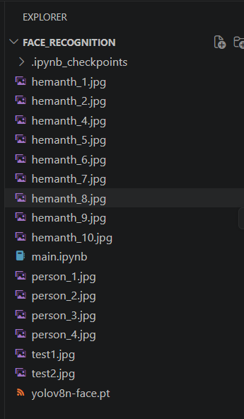

# 🧠 Face Recognition System

A real-time Face Recognition System built using **YOLOv8 for face detection**, **FaceNet for feature extraction**, and **SVM (SVC) for classification**.

---

## 🚀 Overview

This project detects and recognizes human faces from images or live video streams.

It follows a structured pipeline:

1. Face Detection using YOLOv8  
2. Face Extraction and Preprocessing  
3. Feature Extraction using FaceNet  
4. Face Classification using SVM  

---

## 🏗️ Tech Stack

- Python  
- OpenCV  
- YOLOv8 (Face Detection)  
- FaceNet (Embeddings)  
- Scikit-learn (SVM - SVC)  
- NumPy, Pandas  

---

## 📥 YOLOv8 Face Model

We use a pretrained YOLOv8 face detection model.

👉 Download it from:  
https://github.com/akanametov/yolo-face?tab=readme-ov-file

---

## ⚙️ How It Works

### 1. Face Detection
- Detect faces using YOLOv8 model  
- Extract bounding boxes  

### 2. Face Preprocessing
- Crop detected faces  
- Resize and normalize  

### 3. Feature Extraction (FaceNet)
- Convert faces into embeddings (numerical vectors)  

### 4. Face Recognition (SVM)
- Train SVC classifier on embeddings  
- Predict identity of detected face  

---

## 🔄 Workflow

Input Image -> YOLOv8 Face Detection -> Face Cropping -> FaceNet Embeddings -> SVM Classifier -> Recognized Person

---

## 📓 Notebook Structure (`main.ipynb`)

The notebook is organized step-by-step:

### 1. Import Libraries
- OpenCV, NumPy, TensorFlow/PyTorch, sklearn

### 2. Load YOLOv8 Model
- Load pretrained face detection model
- Set confidence threshold

### 3. Face Detection
- Detect faces in images/video
- Draw bounding boxes

### 4. Face Extraction
- Crop detected faces
- Resize to required input size

### 5. Face Embeddings (FaceNet)
- Load FaceNet model
- Convert face images → embeddings (vectors)

### 6. Dataset Preparation
- Store embeddings with labels
- Create training dataset

### 7. Train SVM Model
- Train SVC classifier on embeddings
- Save trained model

### 8. Prediction / Recognition
- Detect face → extract embedding → predict label
- Display name on screen

---

## 📂 Project Structure

